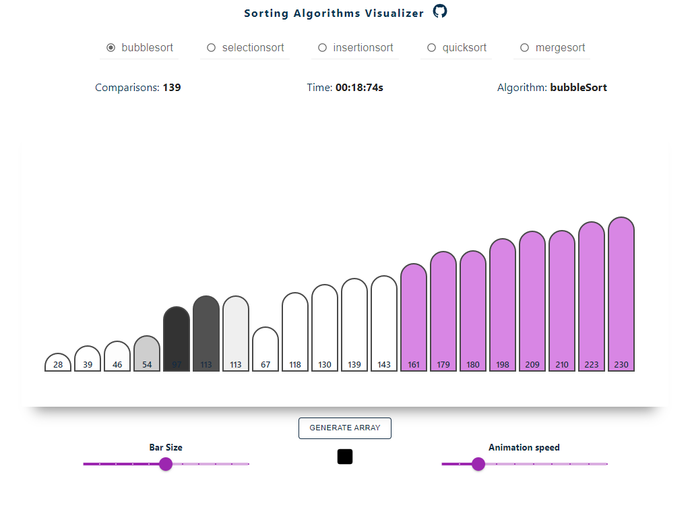

<h1 align="center">
    Algorithm Visualizer
</h1>

## Responsive visualizer built using React for popular algorithms
----
<br/>
<h2>
    Sorting Visualizer
</h2>

<a align="center" href="https://sadanandpai.github.io/sorting-visualizer/dist/"></a>

<br/>


### An attempt to make a visualizer for popular algorithms. So far, finished with visualizing popular sorting algorithms like Bubble Sort, Selection Sort, Insertion Sort, Merge Sort, Quick Sort.
----


## Main Features
----
- understand how sorting algorithms work
- can see total comparisons
- can see how much time it takes to sort an array by different algorithms
- can control both the speed and the bar size
- can start, stop and resume the animation during the sorting process
- generate random arrays

### Technologies
----
- React
-  Pure CSS And for components [React material](https://material-ui.com/)
- [Zustand](https://github.com/pmndrs/zustand) (State management library)
- React Icons

### Plans
----
- 🧪 Write tests for Sorting Visualizer
- 🔍 Add Searching Algorithms Visualizer
- 🛣️ Add Path finding Algorithms Visualizer


### Run in your local
-----
- ```git clone https://github.com/Saifurrahmanemon/Algorithms_Visualizer```
- ```npm install``` (navigate inside directory first)
- ```npm run dev```

---

### Contributing Guide

If you want to contribute, improve or fix bugs in this repo, then check out the [Contributing Guide](./CONTRIBUTING.md)
<br/>

